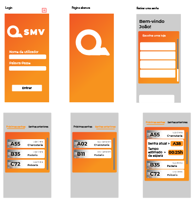
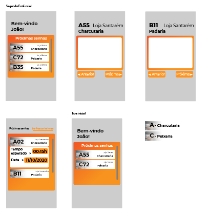
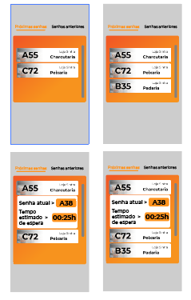
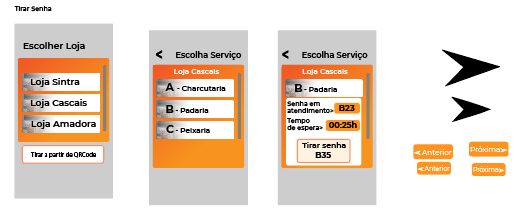
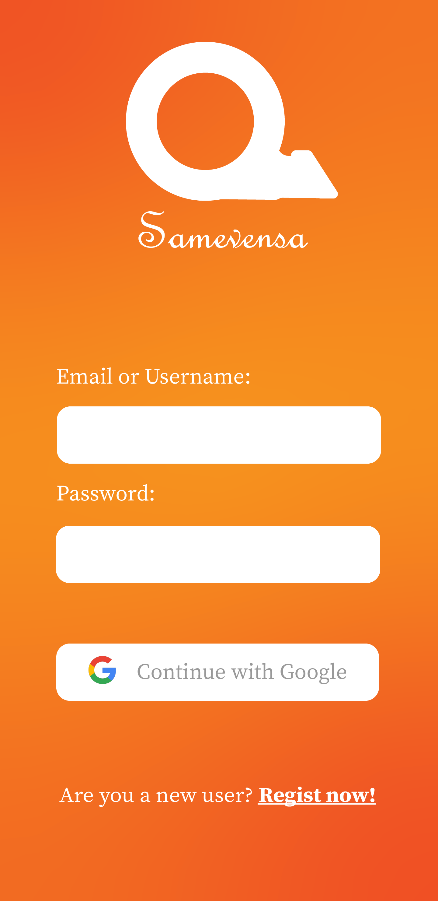
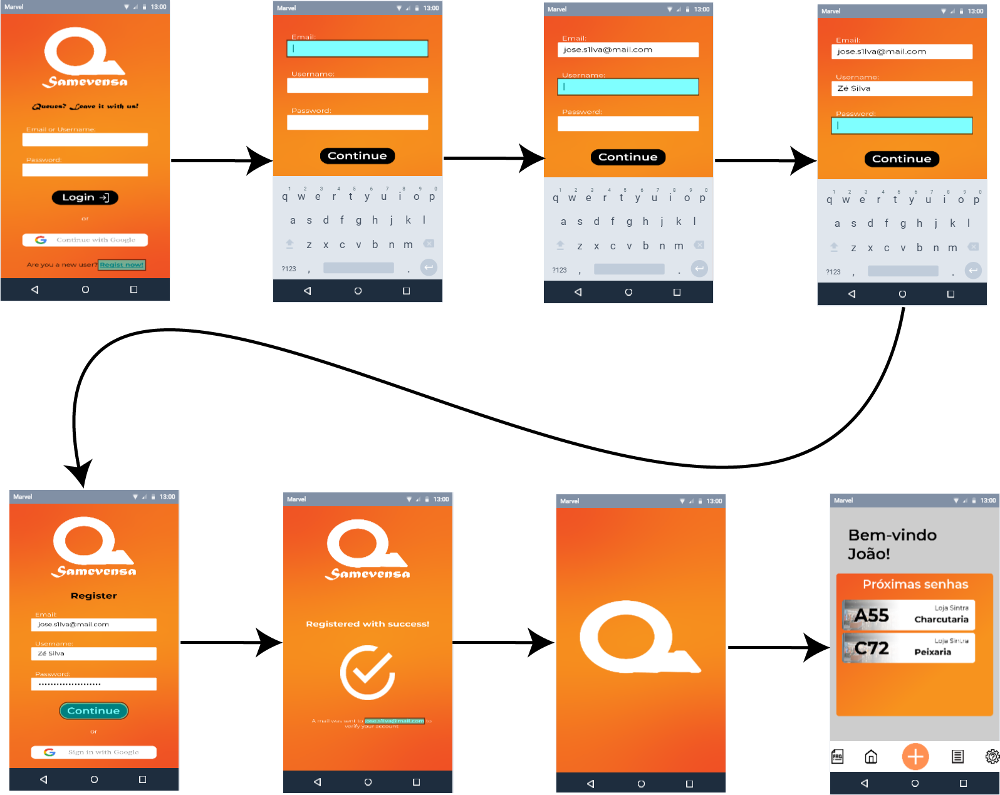
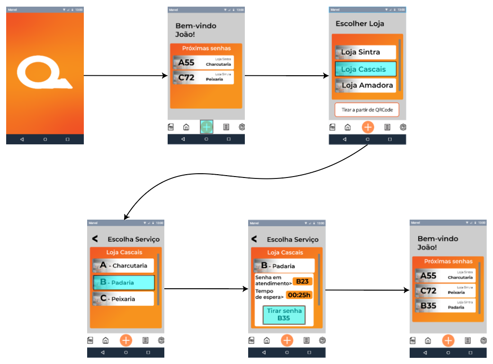

# Stage 3: 1st prototype
- [Stage 3: 1st prototype](#stage-3-1st-prototype)
  - [Sketches (in Adobe Illustrator)](#sketches-in-adobe-illustrator)
  - [Storyboard](#storyboard)
    - [Register](#register)
    - [Take a Number](#take-a-number)
  - [Briefing](#briefing)
  - [Scenarios](#scenarios)

  

## Sketches (in Adobe Illustrator)

 

 

 

 

 

  

## Storyboard

 

### Register

 

### Take a Number

  

## Briefing

 

Our system has the goal to manage the number taken in stores, by giving clients the information of what number is currently being seen and the estimated time to be seen, which will help people to do anything in the mean time. It also will provide statistics that the store manager can use to better help the venue, statistics such as the average waiting time, the busiest periods (being those hours or days), busiest departments.

  

## Scenarios

 

> ### Customer

Mr. José Luís enters Vasco da Gama’s Continente, takes a number to the charcuterie because her daughter loves their cheese.

He also needs meat for lunch, so meanwhile waiting for it’s turn at the charcuterie, he sees through our interface that the current butcher shop number is 38, and if he takes a ticket he’ll be number 59, with an average time of 3 minutes per person, and thinks “Maybe I’ll just pass in the butcher shop at Pingo Doce Olivais”.

Selects the referred shop and sees that there are just 5 people in queue, “Alright! When I arrive there I’ll take a number, it saves me some time and I’m in such a rush right now...”, as he starts thinking on everything he has to do today, receives a notification on his smartphone that his turn has arrived.

 

> ### Admin

Damásio Bonifácio, software engineer at a finances shop in Lisbon, has to analyse some data, such as the number of people that were attended at the shop during this last month, to show to his superior with the goal to achieve some important statistics.

Damásio is a lucky guy, since the website that we provide to the administrators of our application stores the average waiting time, per capita, and the number of customers of the services that the admin are in charge of, allowing him to easily take the information he needs.

 

> ### Clerk

Alfredo Pais is a clerk at Intermarché’s fishmonger, that has had a busy day at his job, serving customer after customer, passing from one to another, sometimes due to his tiredness, he has called a number when there was no one in queue, receiving a message to alert him from his mistake (he can always see the amount of active numbers).
