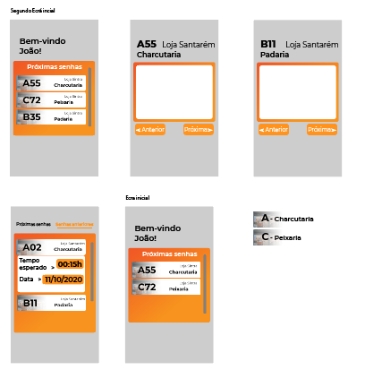
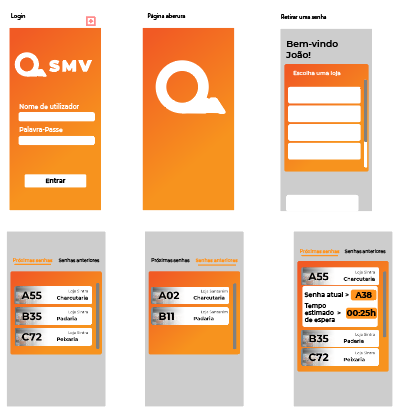
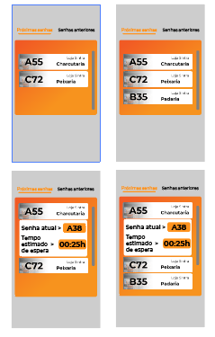
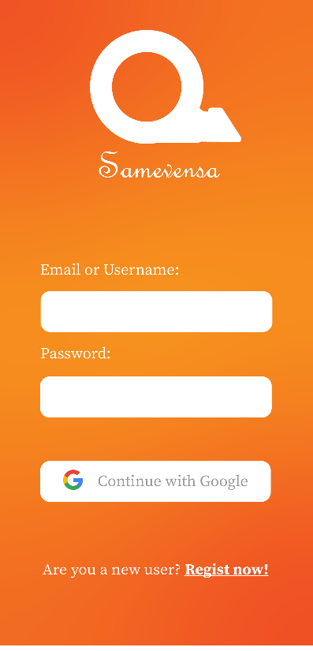
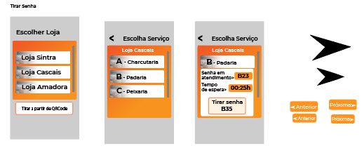
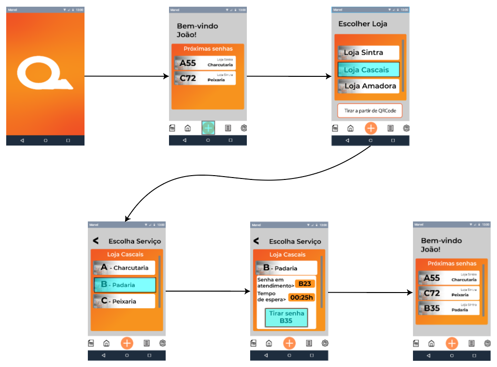
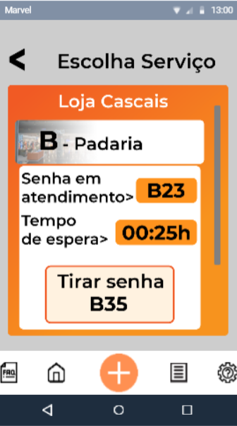
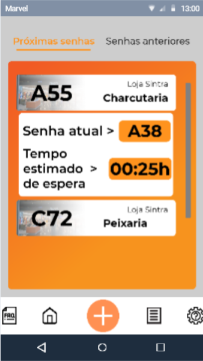
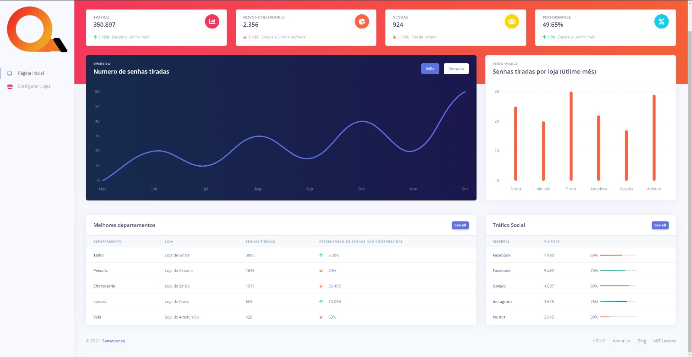

# **Stage 3: 1st prototype**
- [Stage 3: 1st prototype](h#stage-3-1st-prototype)
- [Sketches (in Adobe Illustrator)](#sketches-in-adobe-illustrator)
- [Storyboard](#storyboard)
- [Prototype Photos and Links](#prototype-photos-and-links)
- [Briefing](#briefing)
- [Scenarios](#scenarios)

**Sketches (in Adobe Illustrator)**

##
##
##
## **Storyboard**

 
Register

 
Take a number

## **Prototype Photos and Links**

Customer interface prototype link: <https://marvelapp.com/prototype/8didjc0/screen/83066814>

Back Office interface prototype link: <https://marvelapp.com/prototype/h7jb46h/screen/83067811>
## **Briefing**

Our system has the goal to manage the number taken in stores, by giving clients the information of what number is currently being seen and the estimated time to be seen, which will help people to do anything in the mean time. It also will provide statistics that the store manager can use to better help the venue, statistics such as the average waiting time, the busiest periods (being those hours or days), busiest departments.

## **Scenarios**

1st Scenario

You need bread, and you are near Cascais. The objective is for you to take a ticket for "Padaria" in the "Loja Cascais".

2nd Scenario

You want to retrace your steps from a previous day when you went to a certain shop. Check how much time you spent waiting for your "Charcutaria" in "Loja de Santarém" ticket.

3rd Scenario

You want to see if you have enough time to go to some store before your upcoming ticket. The objective is to check how much estimated time you have to wait for your "Charcutaria" in "Loja de Sintra" ticket.

  

