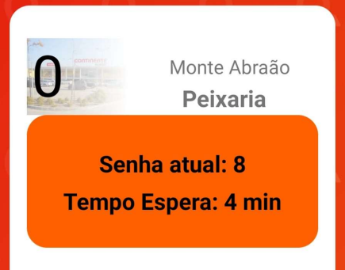

# Stage 4: Functional prototype 

- [Stage 4: Functional prototype](#stage-4-functional-prototype)
  - [**URL**](#url)
  - [**Startup instructions**](#startup-instructions)
  - [**Briefing**](#briefing)
  - [**Scenarios**](#scenarios)
    - [*1st Scenario*](#1st-scenario)
    - [*2nd Scenario*](#2nd-scenario)
    - [*3rd Scenario*](#3rd-scenario)
    - [*4th Scenario*](#4th-scenario)
  - [**Incomplete Parts**](#incomplete-parts)
  - [**Tools**](#tools)

 

## **URL**
 

**Mobile App** : https://drive.google.com/file/d/1gRkxTj2Toksts-6WCo5WUm4shTdjzFj/view?usp=sharing  
**Back-office** : http://casaventura.asuscomm.com:4200/

 
 

## **Startup instructions**
 
Our system is built in two different platforms with different goals, the mobile app
(developed using android 5.4) for final users and a web app (developed using
angular) for the business manager.   
Download the apk, only works in android phones with android 5.4 or higher, if for
some reason you don’t have an android phone available we recommend using blue
stacks. It is an android emulator that works just like a tablet for instance.  (https://www.bluestacks.com/download.html)   
The back-office is a simple browser application.  
For both you need internet. 

 
 

## **Briefing**
 
Our system has the goal to manage the number taken in stores, by giving clients
the information of what number is currently being seen and the estimated time to
be seen, which will help people to do anything in the meantime.     It also will provide
statistics that the store manager can use to better help the venue, statistics such as
the average waiting time by department and number of tickets seen by
department. 

 
 

## **Scenarios**
 

### *1st Scenario*
You need bread, and you are near Sintra.   The objective is for you to take a ticket for
"Peixaria" in the "Loja Sintra".

  

### *2nd Scenario*
You are now the manager of all the stores in samevensa’s system go to the backoffice and call the ticket of “Peixaria” in “Loja Sintra”. 

  

### *3rd Scenario*
You want to see if you have enough time to go to some store before your upcoming
ticket.   The objective is to check how much estimated time you have to wait for
your "Peixaria" in "Loja de Sintra" ticket.

  

### *4th Scenario*
You want to retrace your steps from a previous day when you went to a certain
shop.   Check how much time you spent waiting for your "Peixaria" in "Loja de
Sintra" ticket.

  

## **Incomplete Parts**
 
Our computational prototype isn't fully functional considering its purpose.    Don't
expect the waiting times to add up, nor the ticket (senha) numbers to be
sequential.    The numbers that show up in the dropdown panels are totally
representative, however our database returns true values. But they’re not
consistent with what is shown. 

 

 

As you can see, the number of the ticket is '0', and the current ticket being attended
is 8 which is absurd.    Also, we previously mentioned a QR code ticket management,
however we haven't implemented that yet.    **The prototype is meant to give the user
a feel of what a real situation would look like.**

  

## **Tools**

 

>- Android studio, using Java as the main language to manipulate the data and 
construct the program logic and using our own mobile phones (we also used the
emulator on the pc) to test the app.

 

>- For the management site, we used Visual Studio Code as our IDE, and Angular for
the front-end back-end manipulation.

 

>- For the database we used MongoDB to store all the data in our application (tickets,
departments, user info).

 

>- We also used python to make a websocket.

