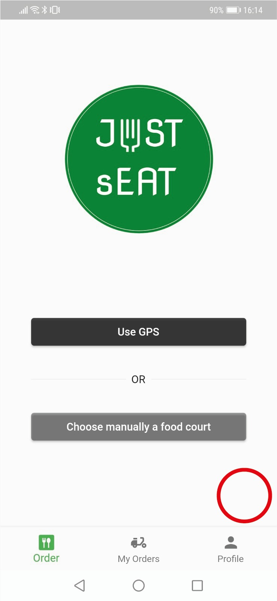
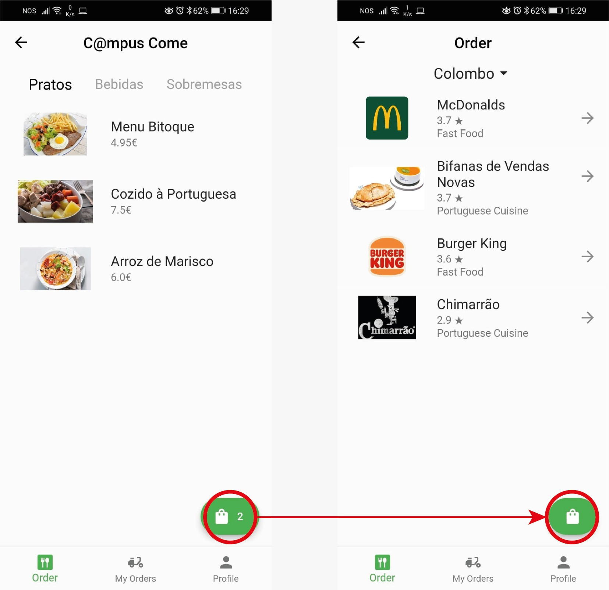
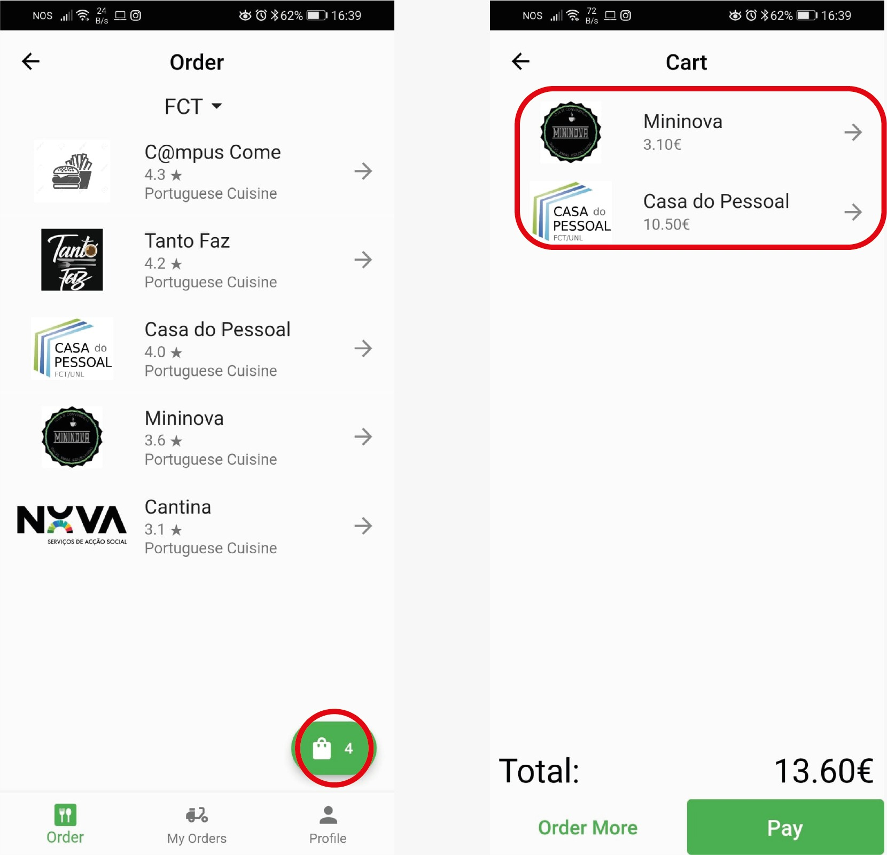
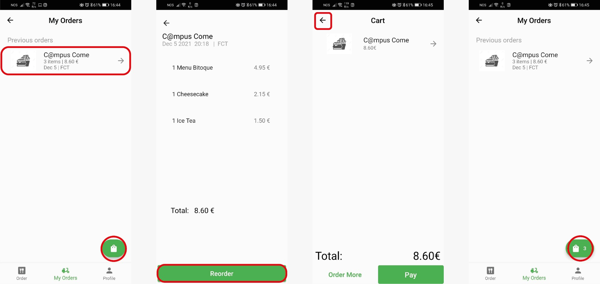

# **Stage 5: Heuristic evaluation**
- [**Stage 5: Heuristic evaluation**](#stage-5-heuristic-evaluation)
  - [Heuristic Evaluation](#heuristic-evaluation)
  - [*Picture 1*](#picture-1)
  - [*Picture 2*](#picture-2)
  - [*Picture 3*](#picture-3)
  - [*Picture 4*](#picture-4)
  - [Delivery](#delivery)

 

## Heuristic Evaluation

 

|  Nº	|   Problem	|   Heuristic	|  Description 	|  Severity 	|   Solution	|   Screenshot	|
|:---:	|:---:	|:---:	|:---:	|:---:	|:---:	|:---:	|
|   1	|   Shopping cart disappears	|   Visibility of system status |   After ordering and returning back to the home page the shopping cart disappears and the user cannot see what they ordered unless they choose a restaurant.	|   3	|   Make the shopping cart visible on the home page.	| [Pic.1](#picture-1)	|
|   2	|   Items in shopping cart get deleted 	|   Visibility of system status 	|   After ordering by gps, assuming we fill the cart with 3 items, and we switch to manually choose a food court the shopping appears empty, when you go back to the gps, and vice versa. 	|   2.5	|  Save the shopping cart info. |   [Pic.2](#picture-2)	|
|   3	|   Shopping cart number confusion	|   Consistency & Standards       Visibility of system status |  After ordering from a food court the shopping cart number shows the number of items you ordered, but when you enter the shopping cart you are presented with the food court form where you ordered, leaving you wondering what the number represents.	|  1.5	|   Display the items, with the information of the food court where they are being ordered.	|  [Pic.3](#picture-3) 	|
|   4	|   Reorder puts items in shopping cart	|  Error prevention	|   If a user reaches the payment page after reordering, and then backs down the items will appear in their shopping cart. 	|   2	|   If the user regrets reordering clear the shopping cart.	|   [Pic.4](#picture-4)	|

 
 

## *Picture 1*

 
 

## *Picture 2*

 
 

## *Picture 3*

 
 

## *Picture 4*

 
 

## Delivery

**Project received on the 12/12/2021**  
**Report delivered on the 16/12/2021**