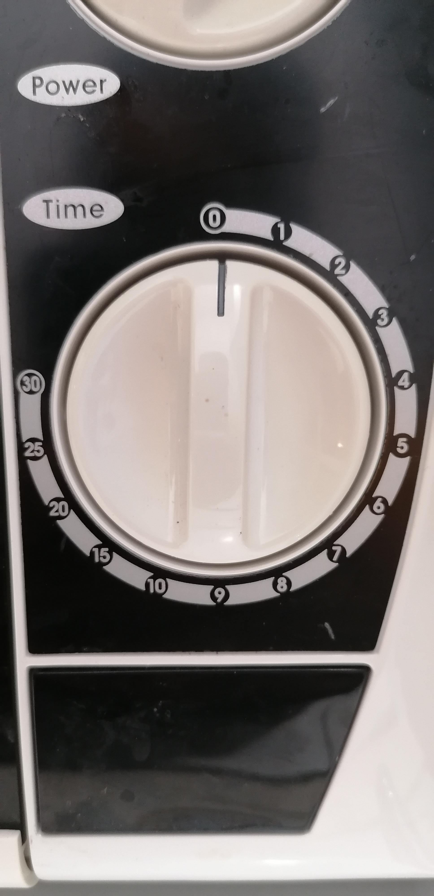
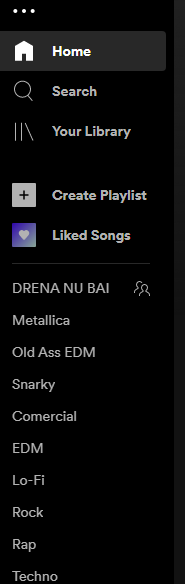

## Example of a Bad Interface

As an example of a bad interface, I chose the timer of my personal microwave at home.

This should be a very intuitive setting of a microwave, and this one changes the scale, for the time, on the rotation of the knob.
A more distracted user could set up the microwave for 11/12 minutes, and instead they would put it up for 15 or 20 minutes,
possibly damaging the food, or even the microwave itself.
My solution to this would be to make an even scale for the timer. It would certainly avoid these issues.

****************

## Example of a Good Interface

For the good example of an interface I took Spotify's side bar, on the desktop version of the app.

It has a set of well labeled buttons. The <i>Home</i>, <i>Search</i> and <i>Your Library</i> buttons are well on top and very clear to see. 
They are really usefull buttons to navigate through the app, whether you are looking for new music or simply want to check your library of songs.

The next two buttons are very self explanatory, and act as a sort of shortcut to create new playlists or see your liked songs.

Finally and most importantly, from my point of view, are the playlists themselves, all simply listed by their names.
This gives out extremely easy and fast access to the music you are most likely to want to listen to in the moment.