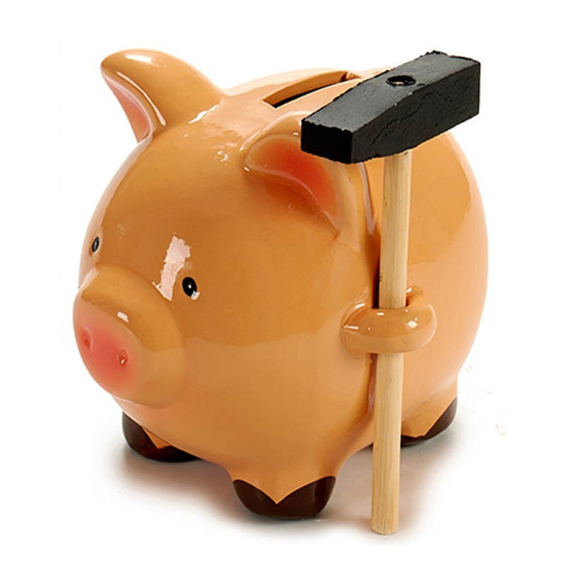
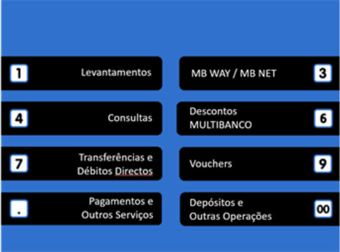

# Delmar Santos Individual Assignment

## Bad Interface

The traditional piggy bank, a funny way for you to store your savings such as coins and bills, in a “safe” place without the temptation of spending all the money you have.

Although it seems pretty cool, it’s not the best interface, at all! If you had save enough money to use it, you have two choices to get the money out: or break the piggy or try to fit all of your coins and bills trough the little fissure where you put the money in at the first place.

The first option makes this piggy non-reusable, since when broken it can’t be repaired, at least easily repaired, and you have to buy a new one using the money you had save, a little counterproductive don’t you think?

The second option to get the money out preserves the piggy bank, but probably you could not retrieve all the money you have put in there, specially bills, that are harder to get out, so… with the money you can retrieve you can possibly buy a drink to recover from all the effort you made.

It’s funny, aesthetically pleasing, and good to store money, but a not so good interface to retrieve it if you want it back.

****

## Good interface

 
An example of a good interface is used in an ATM machine like Multibanco, which has a very intuitive and easy to use interface.

People from almost all ages use Multibanco, even the older ones, that normally have more difficulty to use these electronic interfaces, can use them easily, probably because of the good partitioning of the options available, everything has its place, a normal person can insert the card and when the main menu appears, already know where to click to do the operation she/he wants.

If I want to withdraw money, I click on the “Levantamentos” option and simply select the importance, same with deposits, if I want to do a payment there is also an option in the main menu, then plenty of options that represent the various types of payments.

To select an option I can press the number corresponding to the option or the button on the side of the screen that is next to the wanted option, very simple!
