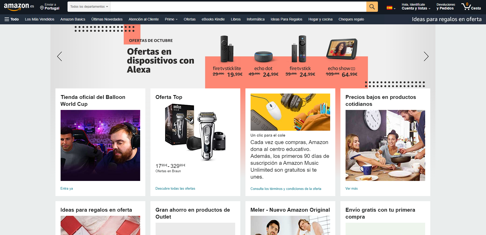

# Miguel Santos Individual Assignment

## Bad Interface

This is the door to the ice maker from a siemens freezer, it is intended to open towards the user
since the mechanism that produces ice blocks the door form opening inwards. That is why there is a groove
bellow the door and a little curve at the bottom of it, so the user can pull, it in order to get it open.

At first glance it might not be a bad interface, but since i have had this freezer for 8 years and everyone
that tries to grab some ice pushes the door instead of pulling it, I consider it a bad interface. This 
has happened to the point that now the door is constantly open inwards, which leads to people pushing it even more.

## Good interface

The interface of Amazon is designed in a way that customers are encouraged to purchase and feel comfortable
with the available design and utilities.

1. There are several item categories. These items are placed apropriately in different sets so that it is easy
for the user to locate and purchase them.
2. The entire website is designed the same way for displaying information. Like this nothing seems out of place
in terms of the look.
3. The website has emphasis on the products. As a result the website is very fast in processing what is needed.

